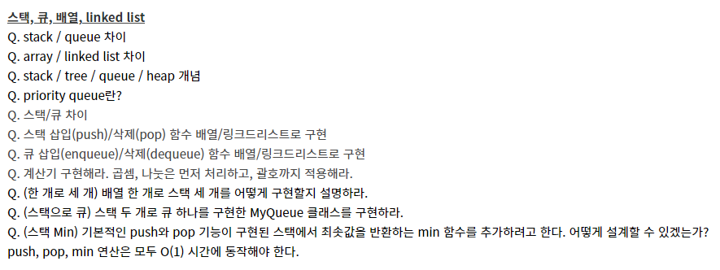
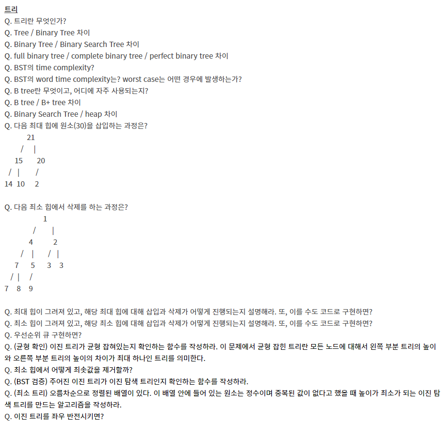

# 자료구조, 알고리즘

## 스택, 큐, 배열, linked list

### Q. stack / queue 차이(자바)

​	스택(stack)이란

​																	후입선출(LIFO, Last-In-First-Out)

​		**차곡차곡 쌓아올린 형태의 자료구조**

​		같은 구조와 크기의 자료를 정해진 방향으로만 쌓을 수 있고 top으로 정한 곳을 통해서만 접근 가능

​		스택에서 top을 통해 **삽입하는 연산**= `push` , top을 통한 **삭제하는 연산** = `pop`

​		시간 순서에 따라 자료가 쌓여서 **가장 마지막에 삽입된 자료가 가장 먼저 삭제된다.**

**스택의 활용 예시**

스택의 특징인 후입선출(LIFO)을 활용하여 여러 분야에서 활용 가능하다.

- 웹 브라우저 방문기록 (뒤로 가기) : 가장 나중에 열린 페이지부터 다시 보여준다.
- 역순 문자열 만들기 : 가장 나중에 입력된 문자부터 출력한다.
- 실행 취소 (undo) : 가장 나중에 실행된 것부터 실행을 취소한다.
- 후위 표기법 계산
- 수식의 괄호 검사 (연산자 우선순위 표현을 위한 괄호 검사)

큐(Queue)란?

​	

​		선입선출(FIFO, First in first out) 방식 

​		사전적 의미: **줄을 서서 기다리는 것**을 의미

​		정해진 한 곳(top)을 통해서 삽입, 삭제가 이루어지는 스택과는 달리 큐는 한쪽 끝에서 삽입 작업이, 다른 쪽 끝에서 삭제 작업이 양쪽으로 이루어진다.

​		큐의 리어에서 이루어지는 삽입연산을 **인큐(enQueue)** 프론트에서 이루어지는 삭제 연산을 **디큐(dnQueue)**라고 부른다. 

- 큐의 가장 첫 원소를 front / 가장 끝 원소를 rear
- 큐는 들어올 때 rear로 들어오지만 나올때는 front부터 빠지는 특성
- 접근방법은 가장 첫 원소와 끝 원소로만 가능
- 가장 먼저 들어온 프론트 원소가 가장 먼저 삭제

  큐에서 프론트 원소는 **가장 먼저 큐에 들어왔던 첫 번째 원소**가 되는 것이며,

  리어 원소는 가장 늦게 큐에 들어온 마지막 원소가 되는 것이다.

**큐의 활용 예시**

​	큐는 주로 데이터가 입력된 시간 순서대로 처리해야 할 필요가 있는 상황에 이용한다.

- 우선순위가 같은 작업 예약 (프린터의 인쇄 대기열)
- 은행 업무
- 콜센터 고객 대기시간
- 프로세스 관리
- 너비 우선 탐색(BFS, Breadth-First Search) 구현
- 캐시(Cache) 구현

#### Stack과 Queue의 가장 큰 차이점은 item을 삭제하는 방법이다

아이템을 삭제할 때, 

​	Stack은 가장 마지막에 추가되있던 item을 삭제

​	Queue는 가장 처음으로 들어와 있던 item을 삭제

Stack과 Queue 모두 **Peek**을 사용할 수 있다. **Peek operation**은 자료구조의 변화를 주지않고, Pop이나, Dequeue를 할 때 리턴되는 아이템을 리턴 할 수 있다.

 --> 뭔소린지 모르겠다

### Q. arraylist & linkedlist 차이점(자바)

LinkedList와 ArrayList는 모두 Java에서 제공하는 List 인터페이스를 구현한 Collection 구현체

#### ArrayList

ArrayList는 내부적으로 데이터를 배열에서 관리하며 데이터의 추가, 삭제를 위해 아래와 같이 임시 배열을 생성해 데이터를 복사 하는 방법을 사용 하고 있다.

대량의 자료를 추가/삭제 하는 경우에는 그만큼 데이터의 복사가 많이 일어나게 되어 성능 저하를 일으킬 수 있다. 반면 각 데이터는 인덱스를 가지고 있기 때문에 한번에 참조가 가능해 데이터의 검색에는 유리한 구현체이다.

#### LinkedList

LinkedList는 데이터를 저장하는 각 노드가 이전 노드와 다음 노드의 상태만 알고 있다고 보면 된다.

ArrayList와 같이 데이터의 추가, 삭제시 불필요한 데이터의 복사가 없어 데이터의 추가, 삭제시에 유리한 반면 데이터의 검색시에는 처음부터 노드를 순회해야 하기 때문에 성능상 불리하다. 

#### 검색

데이터 검색 시에는 ArrayList는 LinkedList에 비해 굉장히 빠르다. ArrayList는 인덱스 기반의 자료 구조이며 `get(int index)` 를 통해 O(1) 의 시간 복잡도를 가진다. 그에 비해 LinkedList는 검색 시 모든 요소를 탐색해야 하기 때문에 최악의 경우에는 O(N)의 시간 복잡도를 가진다.

#### 삽입, 삭제

LinkedList에서의 데이터의 삽입, 삭제 시에는 ArrayList와 비교해 굉장히 빠른데, LinkedList는 이전 노드와 다음 노드를 참조하는 상태만 변경하면 되기 때문이다. 삽입, 삭제가 일어날 때 O(1)의 시작 복잡도를 가진다. 반면 ArrayList의 경우 삽입, 삭제 이후 다른 데이터를 복사해야 하기 때문에 최악의 경우 O(N) 의 성능을 내게 된다.

지금까지의 내용을 정리하면 아래와 같다.

| 리스트     | 설명                                                         |
| ---------- | ------------------------------------------------------------ |
| Array      | 정적인 길이를 제공하는 배열                                  |
| Vector     | Java 1.0 에서 추가. 동기화 기능이 제공되는 가변이 가능한 자료구조 |
| ArrayList  | Java 1.2 에서 추가. 동기화가 제공되지 않음. 데이터의 검색에 유리하며 추가, 삭제에는 성능을 고려해야 한다. |
| LinkedList | Java 1.2 에서 추가. ArrayList 에 비해 데이터의 추가, 삭제에 유리하며 데이터 검색 시에는 성능을 고려해야 한다. |

