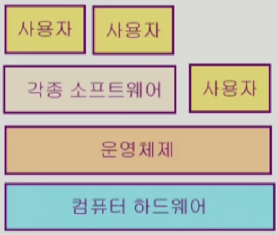
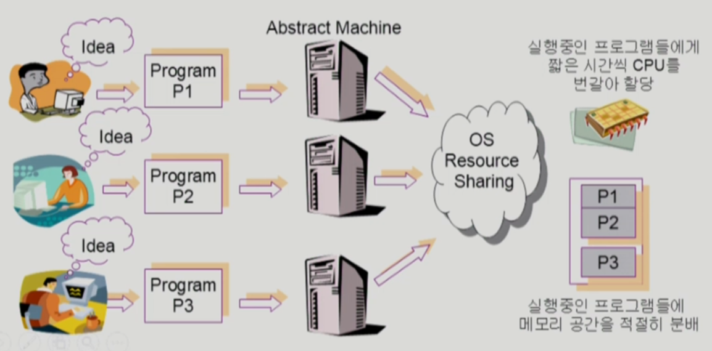

# 운영 체제

http://www.kocw.net/home/search/kemView.do?kemId=1046323

## 운영 체제란?

컴퓨터 하드웨어 바로 위에 설치되는 소프트웨어 계층 => 모든 컴퓨터 시스템의 필수적인 부분

사용자 및 다른 모든 소프트웨어와 하드웨어를 연결하는 소프트웨어 계층

컴퓨터 시스템을 편리하게 사용할 수 있는 환경을 제공

- 운영체제는 동시 사용자/ 프로그램들이 각각 독자적 컴퓨터에서 수행되는 것 같은 환상을 제공
- 하드웨어를 직접 다루는 복잡한 부분을 운영 체제가 대행

#### 컴퓨터 시스템의 **자원(resource)을 효율적으로 관리** => **자원관리자**

- 프로세서, 기억장치, 입출력 장치 등의 효율적 관리

