# CH1 Introduction to Operating System

운영 체제 = operating system

협의의 운영체제(커널) (좁은 의미의 운영체제, 전공자 입장에서의 운영체제)

- **운영체제의 핵심 부분**으로 메모리에 상주하는 부분 = 운영체제의 커널

과의의 운영체제 (넓은 의미의 운영체제)

- 커널 뿐 아니라 각종 주변 시스템 유틸리티를 포함한 개념

### 운영체제의 목적

하드웨어를 효율적으로 관리 => 주어진 하드웨어(cpu, 메모리의 한계 자원)로 최대한의 성능을 내도록!

컴퓨터 시스템의 **자원을 효율적으로 관리**

- 프로세서, 기억장치, 입출력 장치 등의 효율적 관리
  - 사용자간의 형평성 있는 자원 분배
  - 주어진 자원으로 최대한의 성능을 내도록
- 사용자 및 운영체제 자신의 보호
- 프로세스, 파일, 메시지 등을 관리(소프트웨어 자원)

하드웨어 자원 뿐만 아니라 소프트웨어 자원 역시 관리 대상

##### 컴퓨터 시스템을 편리하게 사용할 수 있는 환경을 제공

- 운영체제는 동시 사용자/프로그램들이 각각 독자적 컴퓨터에서 수행되는 것 같은 환상을 제공
- 하드웨어를 직접 다루는 복잡한 부분을 운영체제가 대행

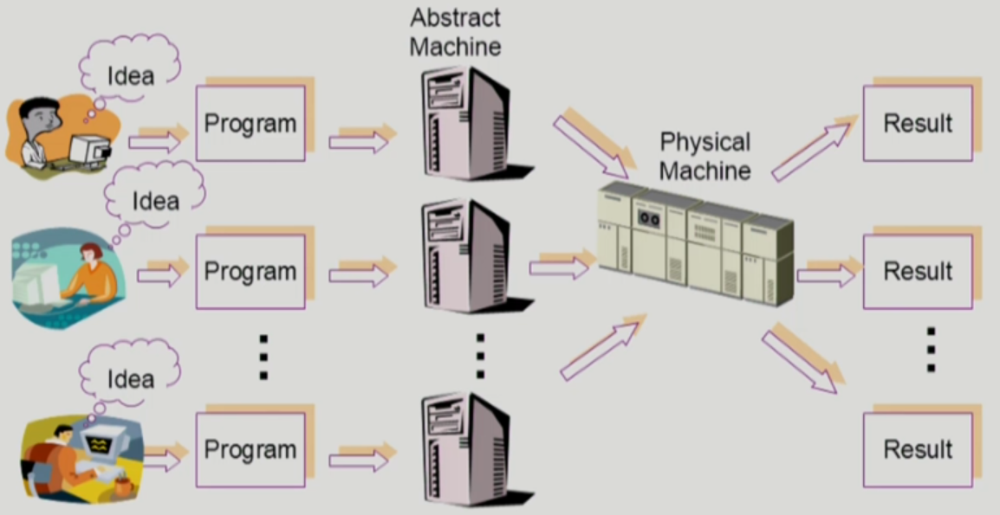

### 운영 체제의 분류

#### 동시 작업 가능 여부

- 단일 작업 (single tasking)
  - 한 번에 하나의 작업만 처리
  - 옛날의 컴퓨터, 특수 목적으로 제작된 기계 등
- 다중 작업 (multi tasking)
  - 동시에 두 개 이상의 작업을 처리
  - 현대의 컴퓨터

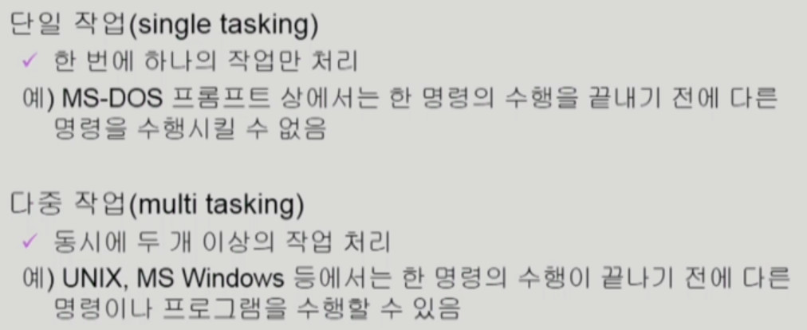

#### 사용자의 수

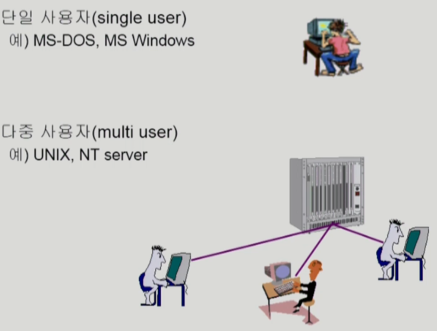

#### 처리 방식

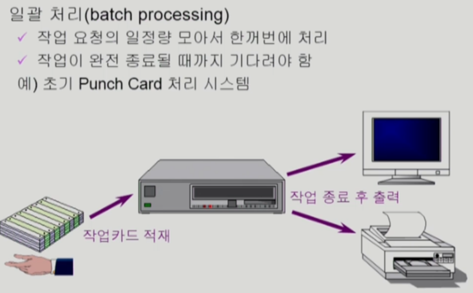

역사 속의 시스템

오류가 나면 시간이 엄청 늘어나게 됨

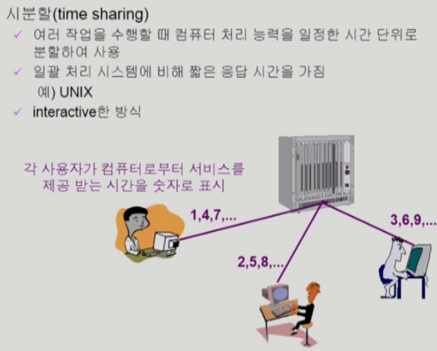

interactive한 방식 => 화면에 결과가 바로 나오는 방식

타임 리미트가 존재하지는 않음

일반적인 범용 컴퓨터에서 사용 => 실시간 deadline를 이야기한 경우가 늘어남

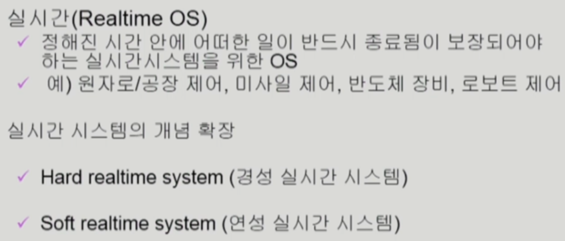

'정해진 시간 안에' => 데드 라인이 존재

특수 목적에서 사용

최근에는 특수 목적 뿐만 아니라 완화가 된 버전도 존재

Hard realtime(기존과 같이 보장을 시켜야 함)

soft realtime(deadline이 존재하지만 심각한 영향을 미치지 않는 경우, 예: 영화 랜더링)

### 용어 정리

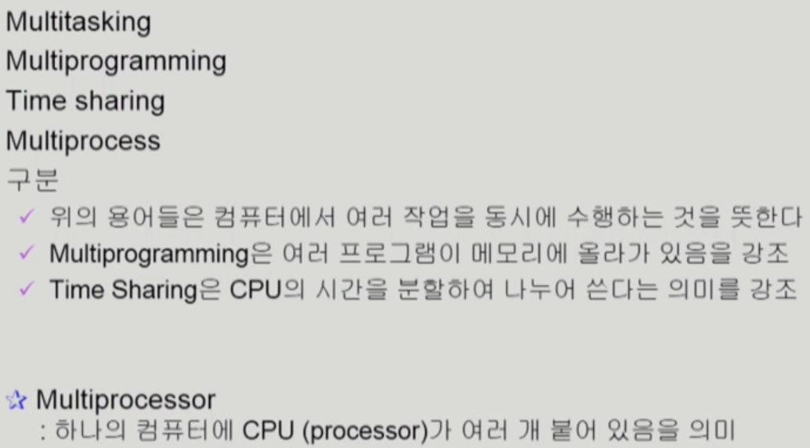

멀티 테스킹 = 여러 프로그램을 동시에 처리

멀티 프로그래밍 = 메모리에 여러 프로그램이 동시에 들어가는 것

타임 셰어링 = (cpu를 강조) 멀티테스킹과 유사한 용어

멀티 프로세스 = 여러 프로그램이 동시에 실행된다

네가지 용어 모두 유사한 용어

but, **멀티프로세서(Multiprocesser) = cpu가 여러 개 붙어있는 컴퓨터**를 칭함, 하드웨어적으로 다른 용어

### 운영 체제의 예

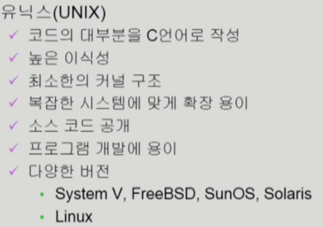

대형 컴퓨터를 위해 만들어진 OS

유닉스를 위해서 언어를 만듬 => C언어(고급언어, 기계어와 가까우면서 사람이 이해가 가능한)

소스 코드 공개(Linux)

이식성 = portable = 다른 컴퓨터에 이식을 하기 용이(C언어를 컴파일만 하면 가능)

리눅스 => 대혐 컴퓨터 뿐만 아니라 개인용 컴퓨터 역시 사용 용이

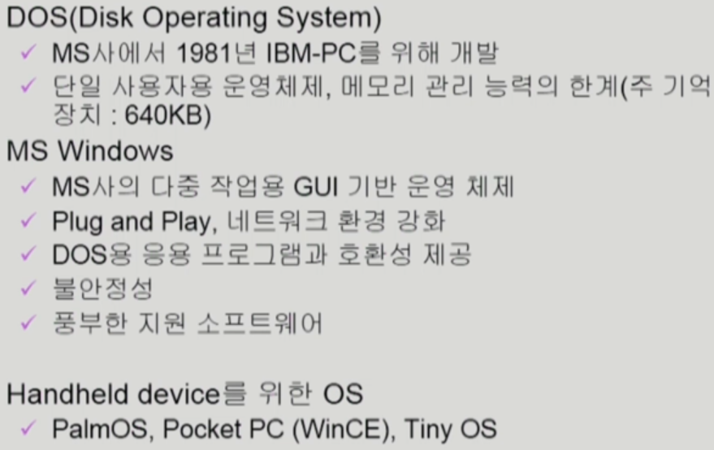

윈도우 : pc(개인 컴퓨터)를 위해 만들어진 OS

DOS : 단일 운영체제

소스코드가 공개되어 있지 않음

초창기 윈도우는 불안했음 => 지금은 아님

+소형 디바이스, 애플에서 만든 디바이스 등 다양한 운영체제 존재

### 운영 체제의 구조

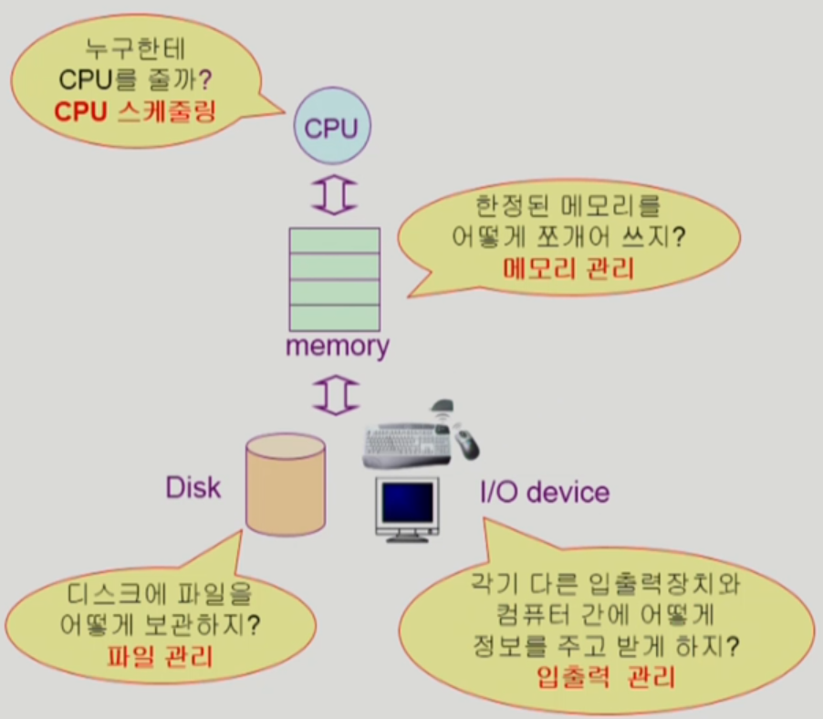

 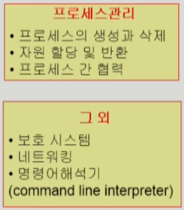

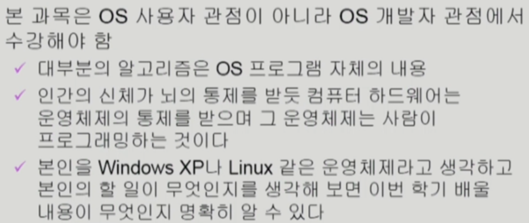