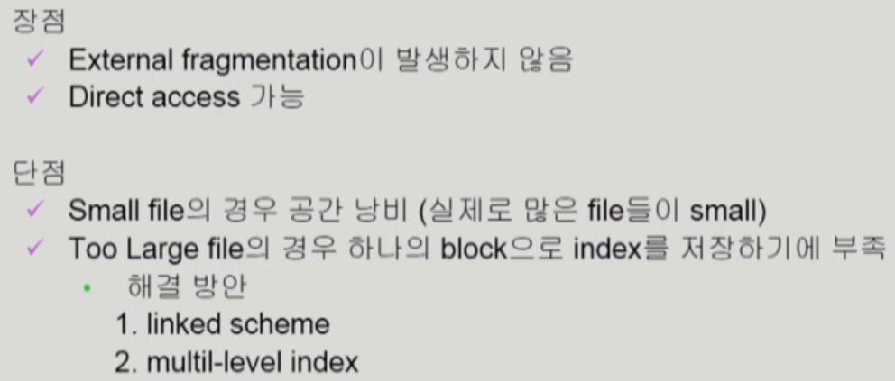
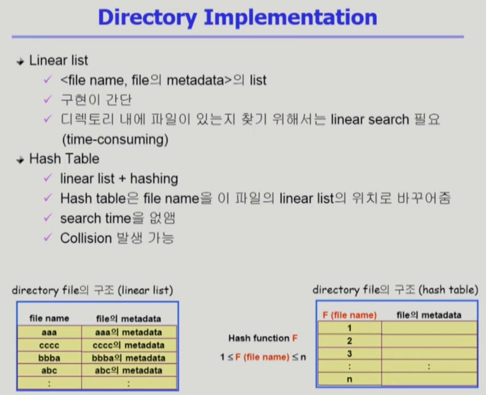
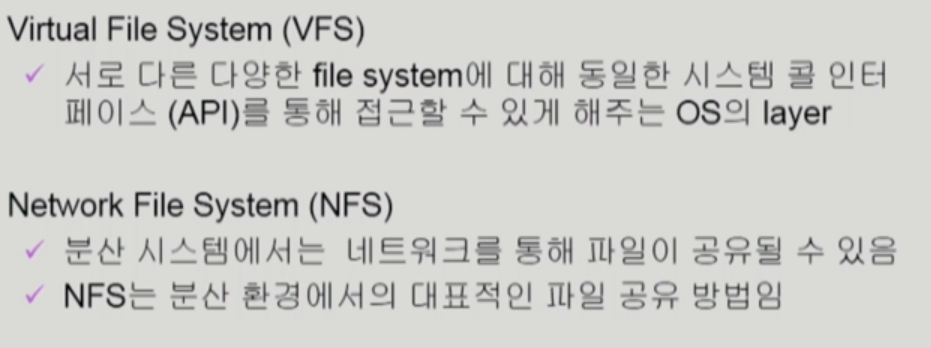

# CH11 File System Implementation

## Allocation of File Data in Disk

파일을 디스크에 저장하는 방법 대표적인 3가지

## UNIX 파일 시스템의 구조

## Free-Space Management

### 비어있는 공간을 관리하는 방법

## VFS and NFS

### 프로그램의 실행

