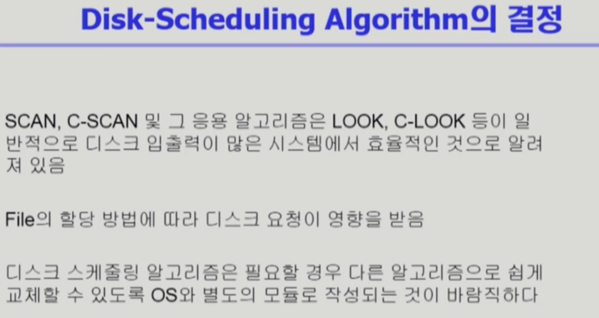

# CH12 Disk Management & Scheduling

## Disk Structure

## Disk Management

## Disk Scheduling

### FCFS (First Come First Serve)

### SSTF (Shortest Seek Time First)

### SCAN

### C-SCAN (Circular-SCAN)

### OTHERS

#### C-LOOK

디스크와 큰 상관은 없지만 정리

