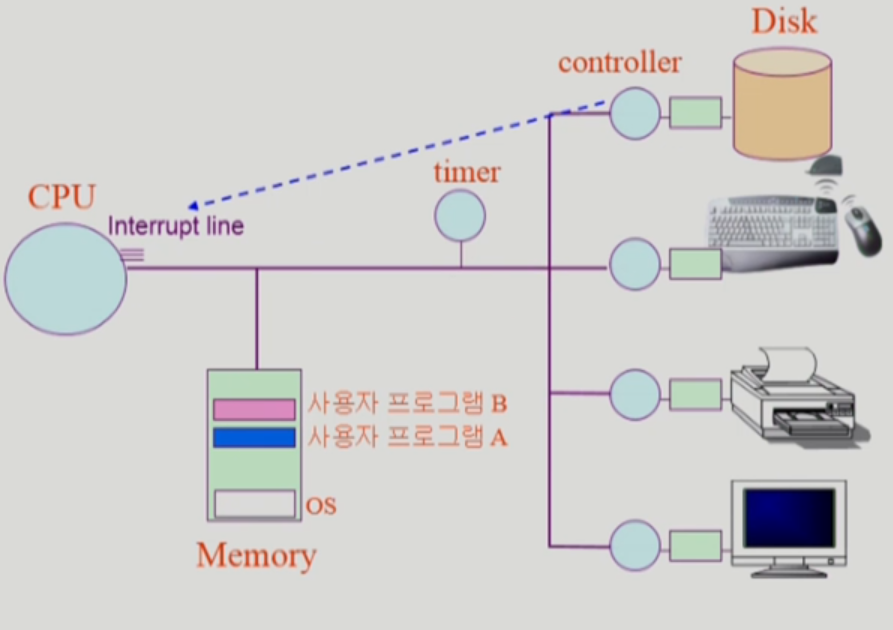

# CH2 System Structure & Program Execution

## 컴퓨터 시스템의 구조

I/O = input & output 

메모리 = cpu의 작업 공간

CPU = 매 순간 메모리에서 기계어를 읽어서 작업을 실행

local buffer = IO 디바이스들의 작은 작업 공간

registers = 메모리보다 빠르고, 정보를 저장할 수 있는 CPU 내부의 공간

CPU => 디바이스 컨트롤러로 정보 요청(CPU가 직접적으로 일을 하지 않음)

#### Mode bit

메모리에서 읽은 정보가 OS인지 사용자 프로그램인지 판단

#### Timer

하드웨어, 특정 프로그램이 CPU를 독점하지 않기 위해 시간 값을 설정

#### Device controller

각각 I/O 디바이스를 전담하는 작은 CPU

#### 입출력(I/O)의 수행

### Interrupt

interrupt line = CPU는 일반적으로 메모하고만 일한다. I/O 디바이스에서 정보를 전달할 때 사용, 

​							들어오는 순간 CPU의 제어권은 OS로 넘어가게 된다

IO에 요청을 할 때에는 소프트웨어 인터럽트를 통해 요청

IO가 처리를 끝났으면 하드웨어인터럽트를 통해 정보를 받음

타이머가 인터럽트를 하는 경우

IO 컨트롤러가 인터럽트를 하는 경우

#### 현대의 운영체제는 인터럽트에 의해 구동됨

### 시스템 콜(System Call)

### 동기식 입출력과 비동기식 입출력

프로세스가 CPU의 존재 여부는 중요하지 않음

프로세스 요청을 보내고 기다리면 => 비동기식 입출력

프로세스 요청을 보내고 바로 다른 정보를 처리하면 => 동기식 입출력

### DMA(Direct Memory Access)

### 저장장치 계층구조

위로 갈수록 속도가 빠르고 용량이 작다

초록 부분은 휘발성

분홍 부분은 비휘발성

### 프로그램의 실행 (메모리 load)

### 커널 주소 공간의 내용

### 함수

### 프로그램의 실행

