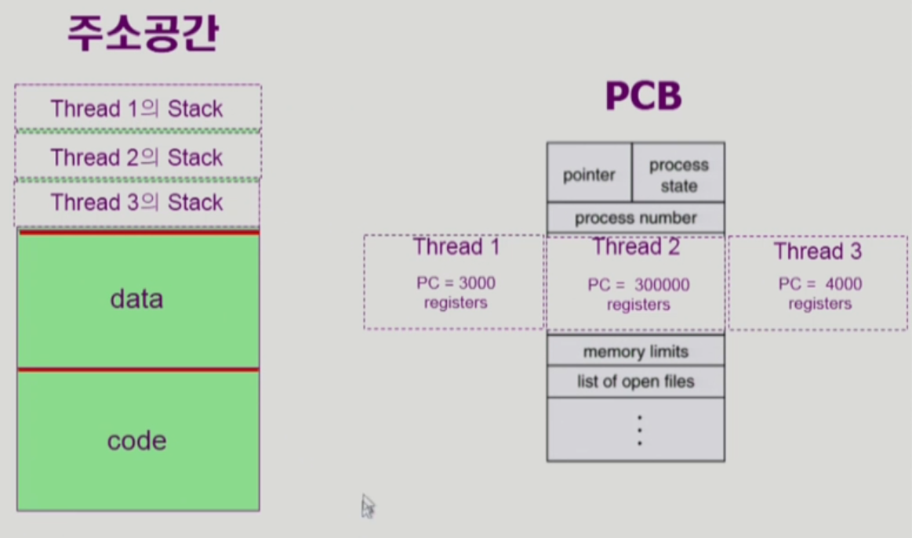

# CH3 Process

> process is a program in execution

### 프로세스의 문맥(context)

CPU 수행 상태를 나타내는 하드웨어 문맥

- program counter
- 각종 register

메모리와 관련된 프로세스의 주소 공간

- code, data, stack

프로세스 관련 커널 자료 구조

운영체제 = 프로세스를 관리하기 위해 PCB를 생성

- PCB(Process Control Block)
- Kernel stack

## 프로세스의 상태(Process State)

### 프로세스는 상태가 변경되며 수행된다

#### Running

- CPU를 잡고 instruction을 수행중인 상태

#### Ready

- CPU를 기다리는 상태(메모리 등 다른 조건을 모두 만족하고)

#### Blocked(wait, sleep)

- CPU를 주어도 당장 instruction을 수행할 수 없는 상태
- Process 자신이 요청한 event(예 I/O)가 즉시 만족되지 않아 이를 기다리는 상태
-  (예) 디스크에서 file을 읽어와야 하는 경우

##### New

- 프로세스가 생성중인 상태

##### Terminated

- 수행(execution)이 끝난 상태
- 끝났지만 정리해야 할 데이터가 남아있는 경우가 존재

## 프로세스 상태도

## PCB (Process Control Block)

## 문맥 교환(Context Switch)

세이브 하는 위치는 프로세스 안의 커널의 PCB에 저장하는 공간이 존재

### 프로세스를 스케줄링하기 위한 큐

### Job queue

- 현재 시스템 내에 있는 모든 프로세스의 집합

### Ready Queue와 다양한 Device Queue

### 프로세스 스케줄링 큐의 모습

## 스케줄러(Scheduler)

Suspended 상태 => CPU뿐만 아니라 외우에서 강제로 정지 시켜놓은 상태

=> 위의 중기 스케줄러에 의해 정지 되어진 상태를 말한다

### 프로세스 상태도

## Thread

#### 프로세스 하나에 CPU 수행 단위만 여러 개 두고 있는 것을 Thread라고 한다

나머지 정보는 서로 공유(Task => 1개만 존재)를 해서 불필요한 데이터를 줄인다

### Thread 장점

자원을 절약할 수 있다.(메모리 낭비를 막는다)

병렬성 => CPU가 여러개인 특수 컴퓨터의 장점

1 응답성 => 하나의 스레드가 블럭이 되면 다른 스레드들이 읽어온 문서를 먼저 요청을 하기 때문에 빠른 응답이 가능하다

2 자원의 공유

3 경제성 => 하나의 프로세스를 만드는 것보다 스레드를 추가하는 것이 훨씬 간단하다

4 CPU가 여러개인 환경에서 => 병렬적인 일을 할 수 있다

### Single and Multi-threaded Process

### Implementation of Thread(스레드 구현 방법)

커널 스레드 => 커널이 스레드가 여러개인 것을 알고 있어서 자연스럽게 넘길 수 있다

유저 스레드 => 커널은 스레드가 여러개인 것을 모르지만, 프로세스가 스스로 여러개를 나눈다

