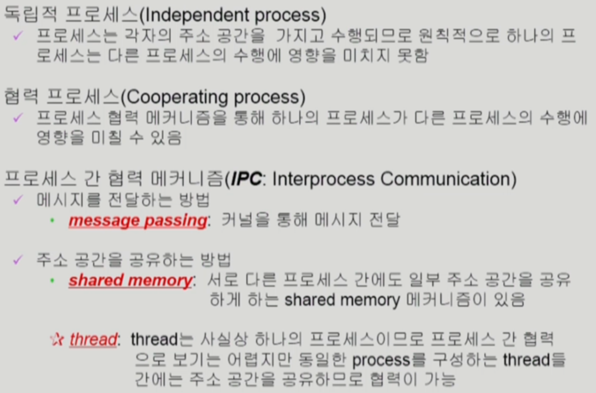

# CH4 Process Management

## 프로세스 생성(Process Creation)


운영체제를 통해서만 생성 가능

복제 후 새로운 것을 덮어 씌우는 방법을 보통 사용


### Copy-on-Write(COW)기법

write가 발생했을 때 copy를 하겠다

자원의 공유를 최대로 하는 모델


## 프로세스 종료


## `fork()` 시스템 콜


`fork()` => 시스템 콜

자식 프로세스는 `fork()` 이후부터 코드를 실행

자식 프로세스는 메인 함수의 시작부터 실행되는 것이 아니다


복제를 하였을 때 부모와 자식 프로세스를 구분하기 위해

​			부모 프로세스는 fork의 결과값이 양수가 된다

​			자식 프로세스는 fork의 결과값이 0이 된다


부모 프로세스

​	=> 프린트 후 `fork()` 실행 +` pid>0`인 프린트 실행

자식 프로세스

​	=>` fork() `이후의 프린트(`pid==0`인)만 실행

But, 자식 프로세스에도 fork 이전의 프린트를 실행하였다는 기억은 존재하게 된다


## `exec()` 시스템 콜


exec로 생성되는 자식 프로세스는 그동안의 기억(부모 프로세스가 실핸한 결과들 + 자식 프로세스가 실행한 결과들)을 완전히 잊고 새로운 프로그램으로 덮어씌워지게 된다


```c++
hello 3
#값이 출력된다
```


# `wait()` 시스템 콜

자식 프로세스가 종료되길 기다리면서 부모 프로세스를 block 시키는 방법


## `exit()` 시스템 콜


### 프로세스와 관련된 시스템 콜


## 프로세스 간 협력

원칙적으로 프로세스는 독립적



### Interprocess Communication

#### Shared memory


#### Message Passing

