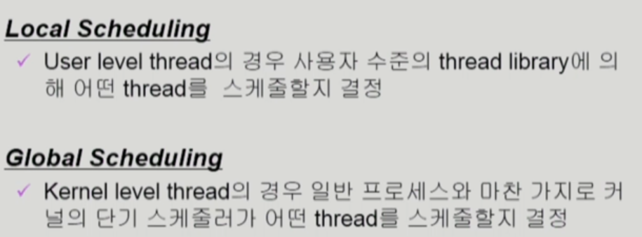

# CH5 CPU Scheduling

## CPU ans I/O Bursts in Program Execution

## CPU-burst Time 분포

CPU는 '일반적으로' CPU bound job를 많이 쓰지만, I/O bound job의 경우 빈도가 높아 frequency가 높다

## 프로세스의 특성 분류

## CPU Scheduler & Dispather

두 가지 모두 소프트웨어의 종류

비선점형 nonpreemptive

선점형    preemptive 

## 성능 척도 Scheduling Criteria

## Scheduling Algorithm

### FCFS (First-Come First-Served)

### SFJ (Shortest-Job-First)

### Property Scheduling

### RR (Round Robin)

응답시간이 빨라진다

### Multilevel Queue

### Multilevel Feedback Queue

## Scheduling

### CPU가 여러개인 경우의 스케줄링

### Real-Time Scheduling

=> deadline이 존재하는 경우 

deadline을 보장받아야한다

### Thread Scheduling

## Algorithm Evaluation 알고리즘 성능 척도

