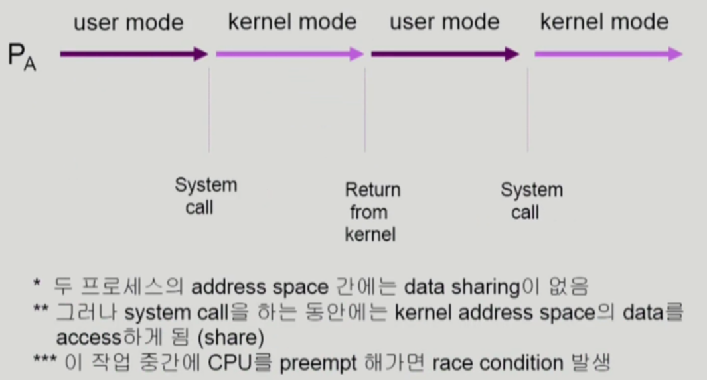
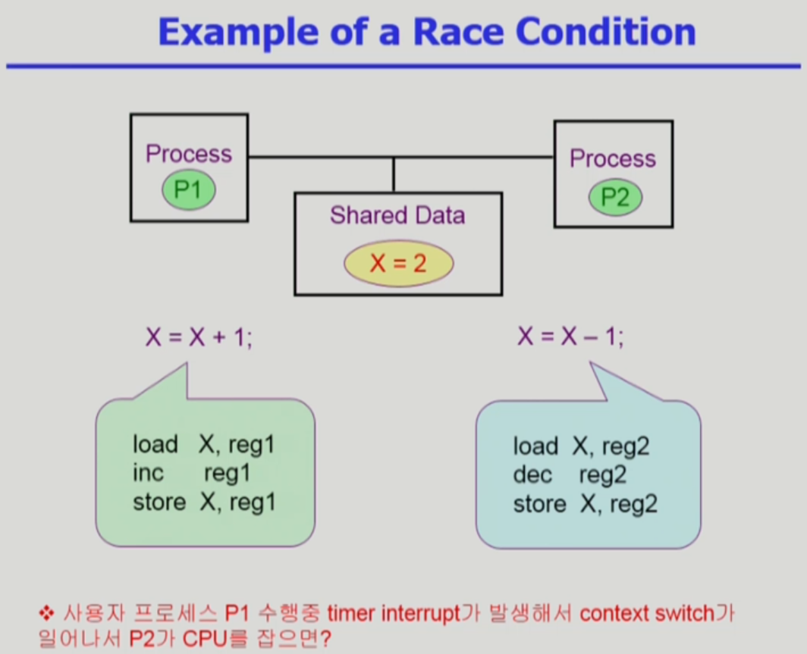
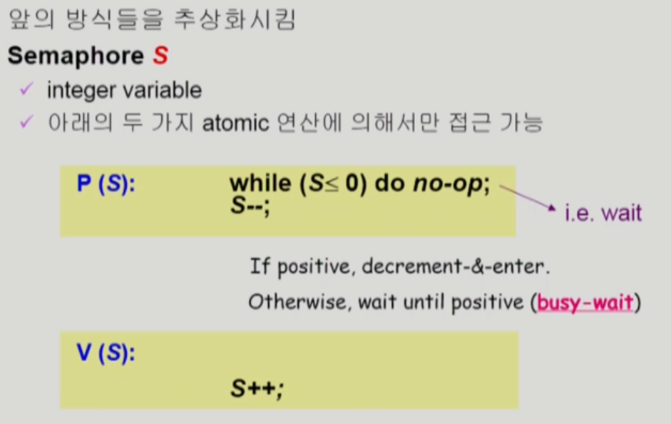
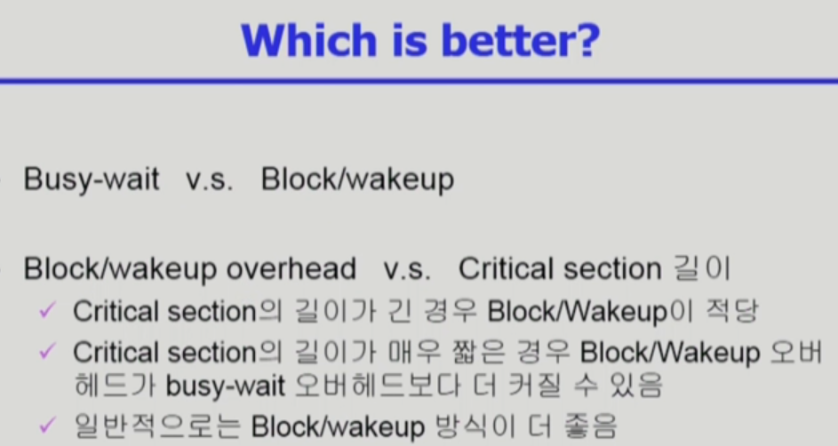
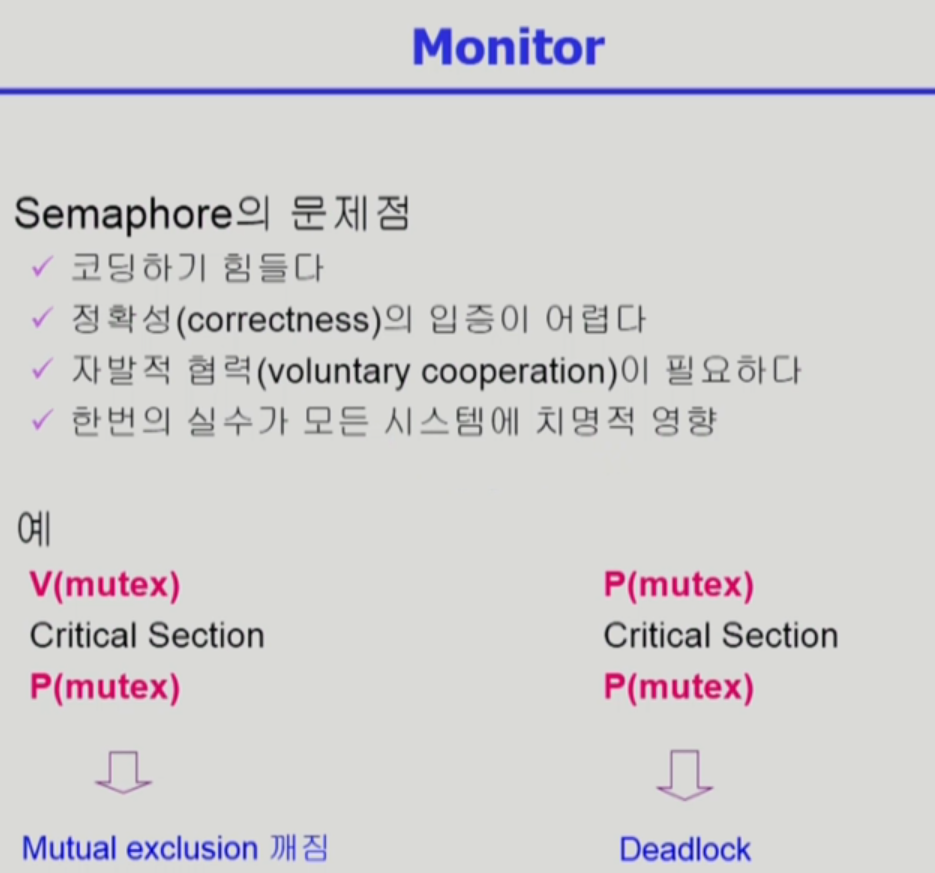

# CH6 Process Synchronization

## 데이터의 접근

## race condition 경쟁 상태

#### 1. kernel 수행 중 인터럽트 발생 시

#### 2. Process가 system call을 하여 kernel mode로 수행 중인데 context switch가 일어나는 경우

#### 3. Multiprocessor에서 shared memory 내의 kernel data

문제 해결을 위해서 중요 변수를 처리하는 동안에는 인터럽트 처리를 하지 않게(disable) 한다

시스템 콜을 통해 유저모드와 코드모드를 동시에 실행 할 때

코드를 실행하다가 커널의 코드가 실행중일 때 할당 된 시간이 끝날 경우

=> 커널 모드에서 실행 중일 때에는 할당 시간이 끝나도 CPU를 빼았기지 않도록 한다.

CPU가 여럿이 있는 환경 => 데이터에 대해 rock을 걸고 푸는 방법을 통해 해결

## Process Synchronization 문제

## 임계구역 The Critical-Section problem

## 프로그램적 해결법의 충족 조건

### Mutual Exclusion(상호배제)

#### 프로세스 Pi가 critical section 부분을 수행중이면 다른 모든 프로세스들은 그들의 critical section에 들어가면 안된다.

### Progress(진행)

#### 아무도 critical section에 있지 않은 상태에서 critical section에 들어가고자 하는 프로세스가 있으면 critical section에 들어가게 해주어야 한다.

### Bounded Waiting(유한 대기)

#### 프로세스가 critical section에 들어가려고 요청한 후부터 그 요청이 허용될 때까지 다른 프로세스들이 critical section에 들어가는 횟수에 한계가 있어야 한다.

##### 가정

##### 모든 프로세스의 수행 속도는 0보다 크다.

##### 프로세스들 간의 상대적인 수행 속도는 가정하지 않는다.

### Algorithm 1

### Algorithm 2

### Algorithm 3 (Peterson's Algorithm)

문제점 busy waiting(=spin lock)

= 비효율적인 방법

### Synchronization Hardware

## Semaphores (추상 자료형)

## Bounded-Buffer Problem(Producer-Consumer Problem)

