# CH7 Deadlocks

## 교착상태

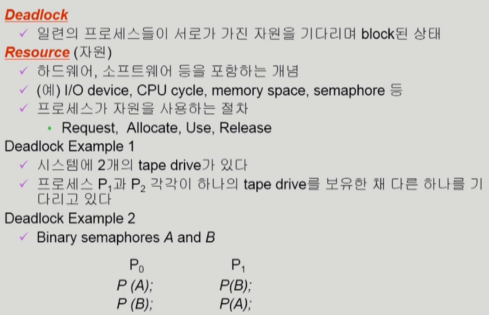

### Deadlock 발생의 4가지 조건

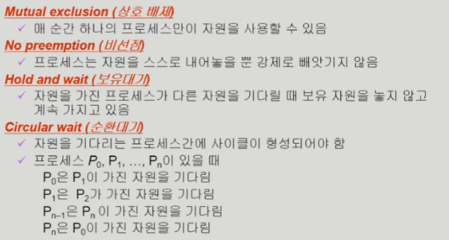

### Resource-Allocation Graph(자원 할당 그래프)

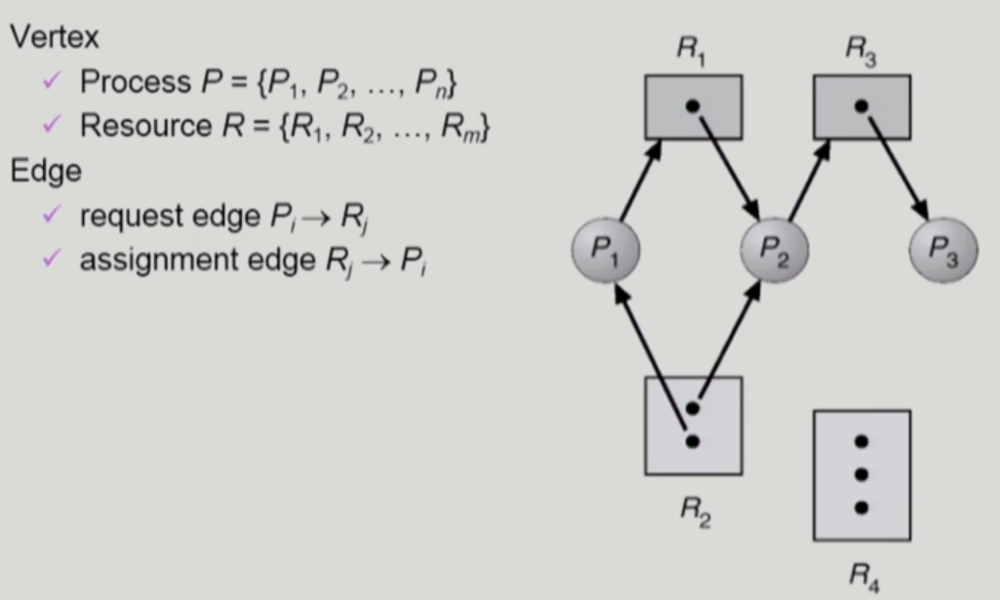

동그라미는 프로세스 

점은 자원

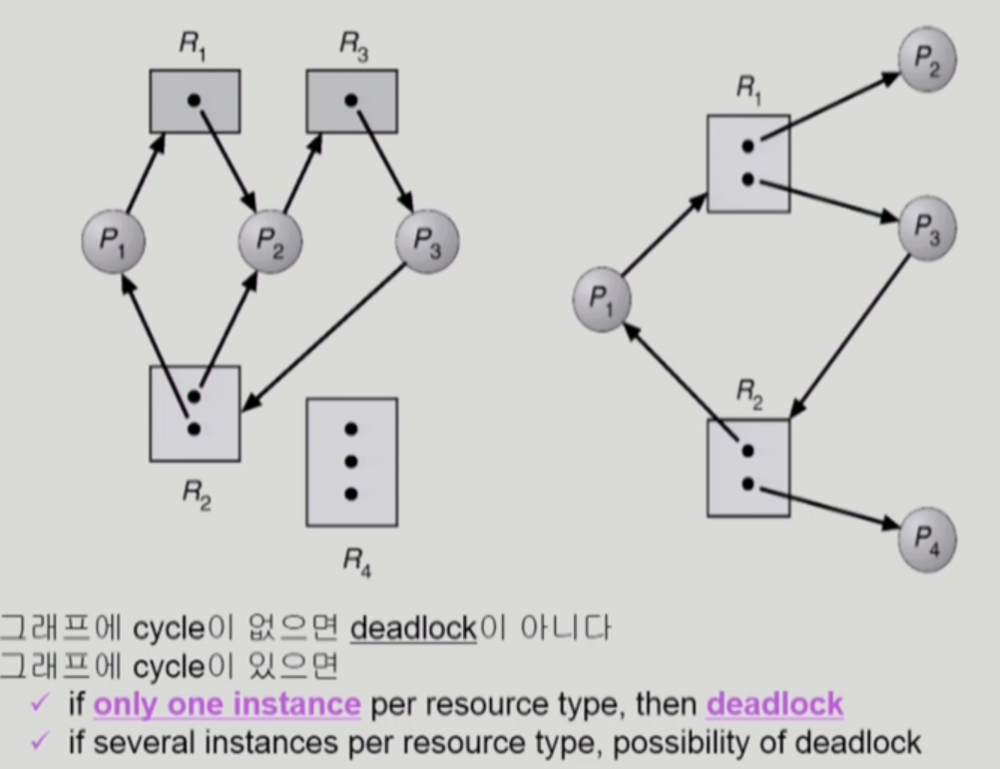

## Deadlock 처리 방법

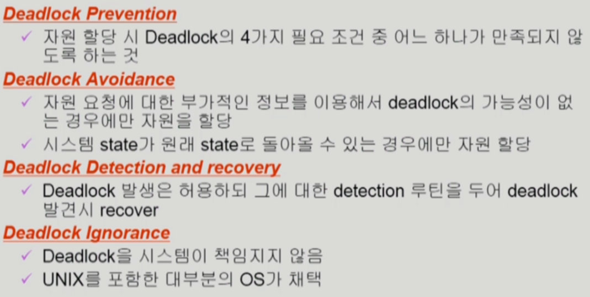

### 1. Deadlock Prevention

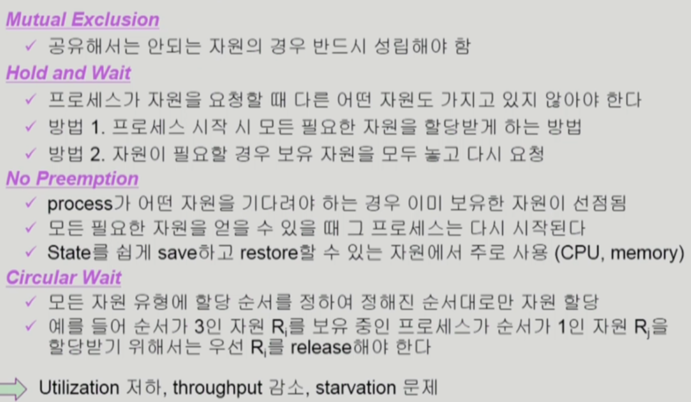

### 2. Deadlock Avoidance

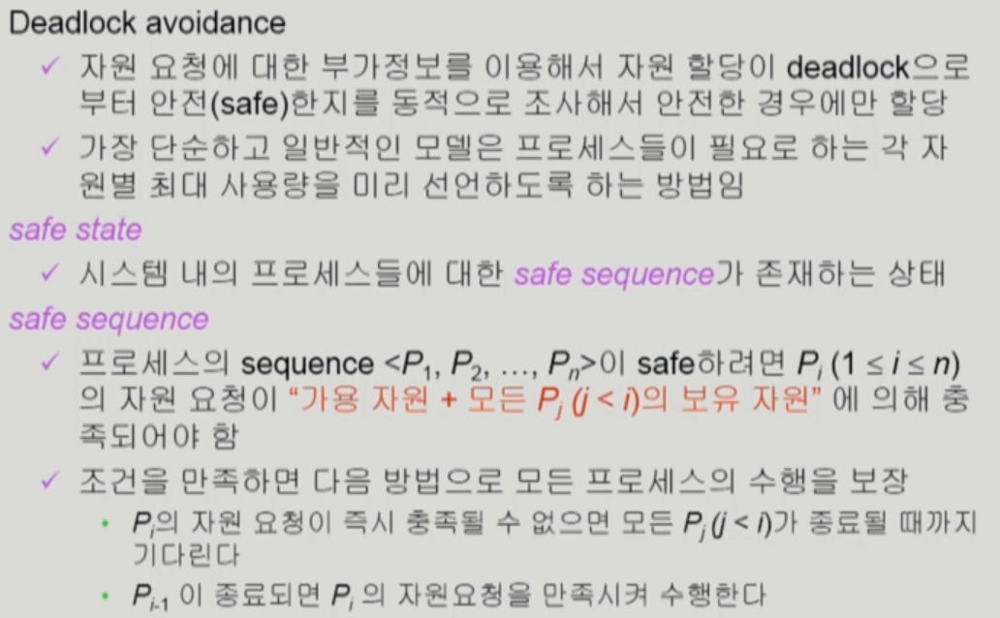

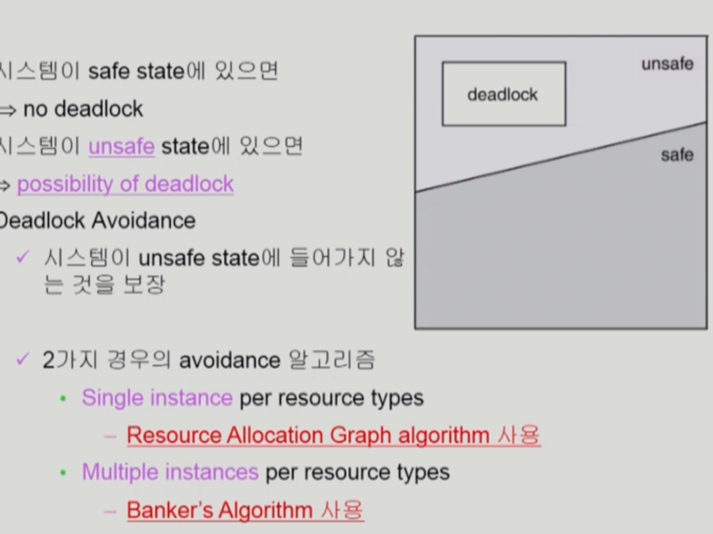

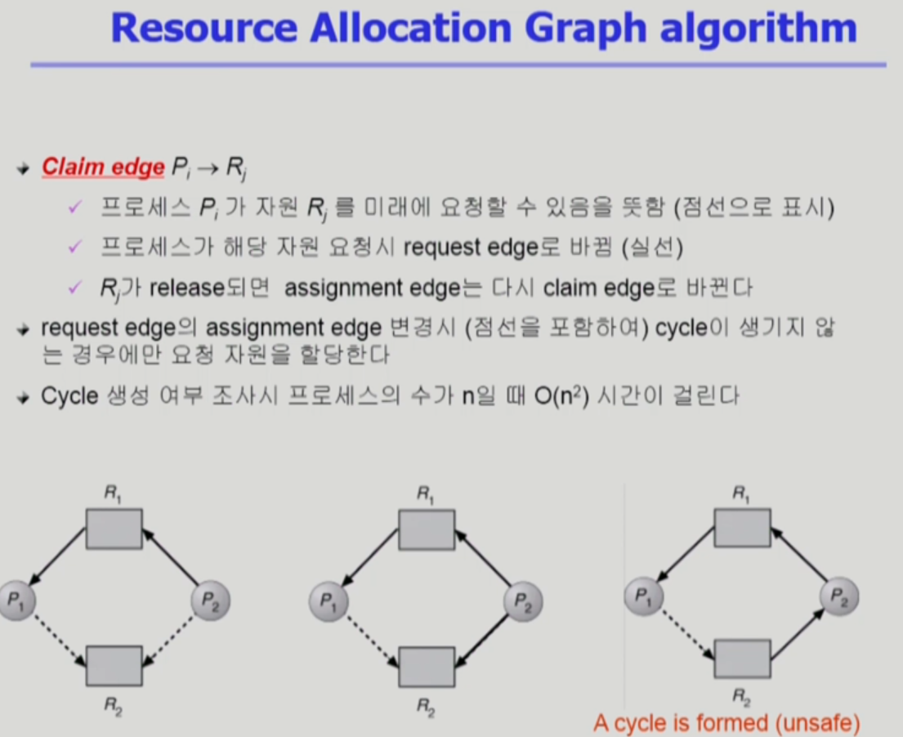

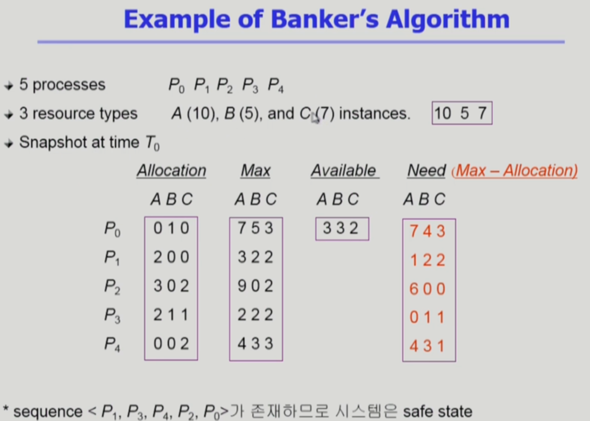

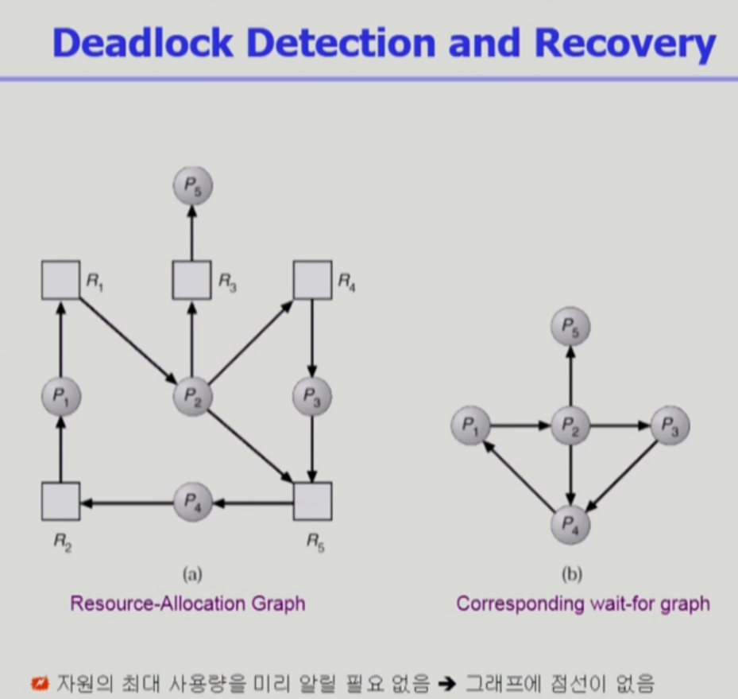

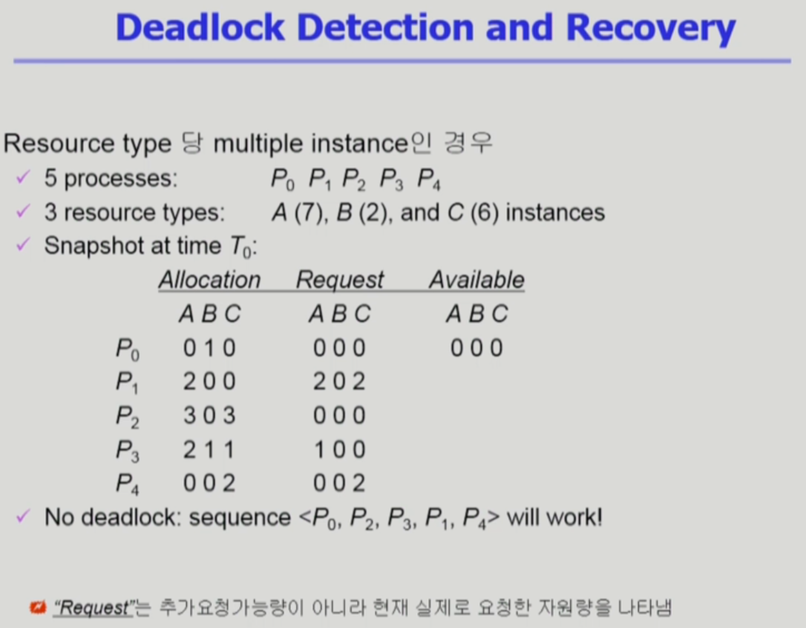

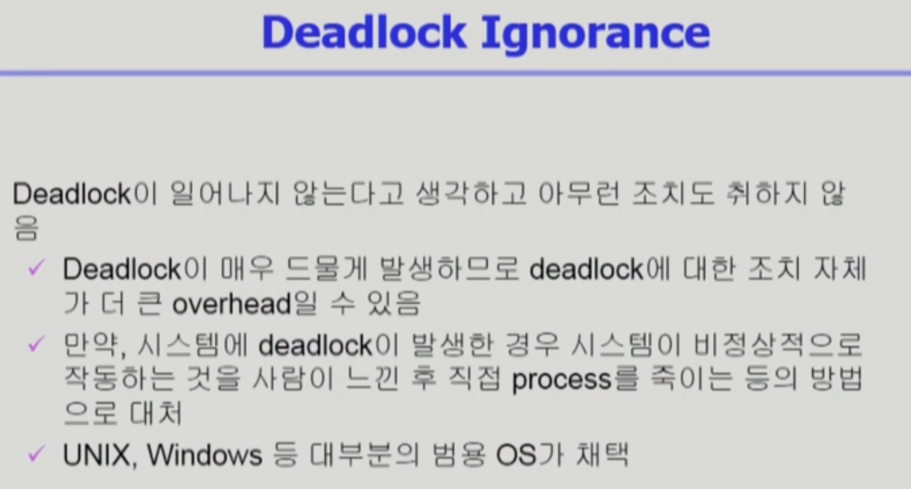

