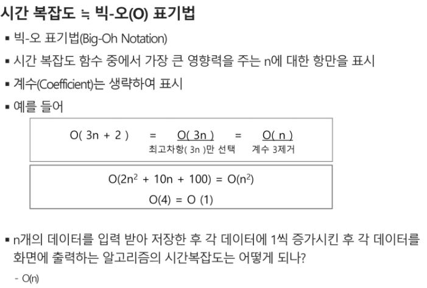
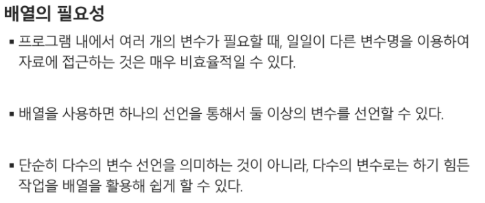
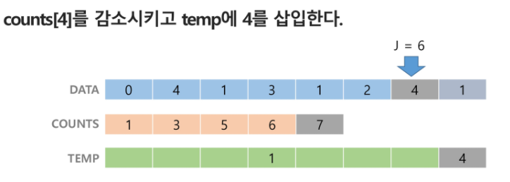
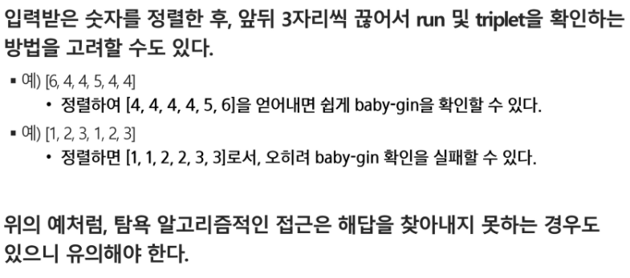
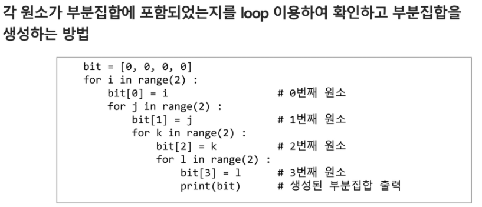
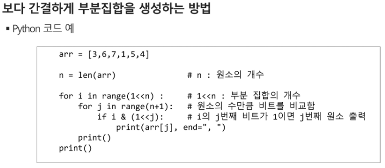
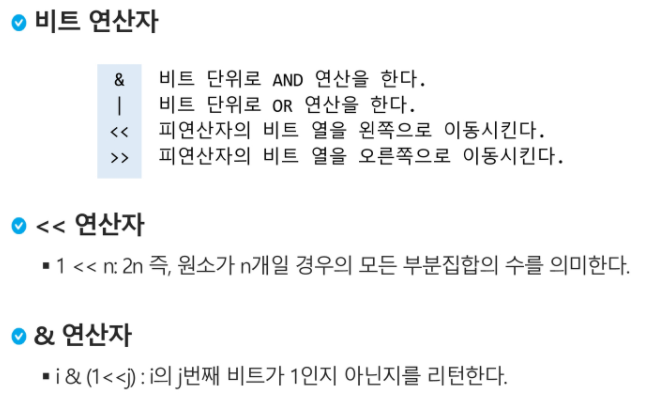
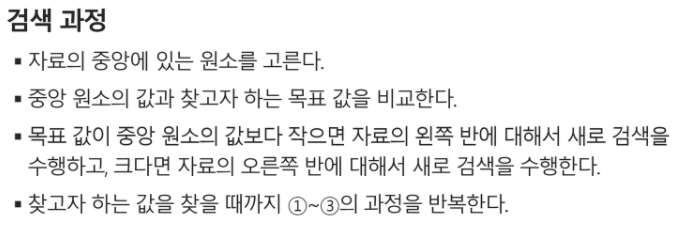

# 알고리즘 서술형 과연

서술형

리스트 개념자체

검색 방법

그리디 알고리즘

쏘트 3가지

검색, 부분집합

패턴 매칭은 볼 필요 없음

### APS(Algorithm Problem Solving)

### 개념

#### 시간 복잡도(Time Complexity)

실제 걸리는 시간을 측정

O(n)

### 배열

#### 일정한 자료형의 변수들을 하나의 이름으로 열거하여 사용하는 자료구조

## Sort 정렬

### 버블 정렬

#### 인접한 두개의 원소를 비교하며 자리를 계속 교환하는 방식

#### O(n^2)	

### 카운팅 정렬

#### 항목들의 순서를 결정하기 위해 집합에 각 항목이 몇 개씩 있는지 세는 작업을 하여,

#### 선형 시간에 정렬하는 효율적인 알고리즘

#### O(n + k)

#### 1 count라는 새로운 리스트를 만들고 각각의 숫자가 몇개씩 있는지 센다

#### 2 count에 있는 숫자를 감소시키고 temp 리스트에 그에 위치하는 숫자를 삽입한다

### 선택 정렬

최소, 최댓값을 찾고 그 값을 선택해서 원하는 위치로 이동

퀵 정렬

삽입 정렬

병합 정렬

## 그리드 알고리즘(탐욕)

최적해를 구하는데 사용되는 근시안적인 방법

### 2차원 배열

지그재그

# 부분집합(나오면 올킬(잘하는 사람 제외))

2n => 2^n

### 이진검색

